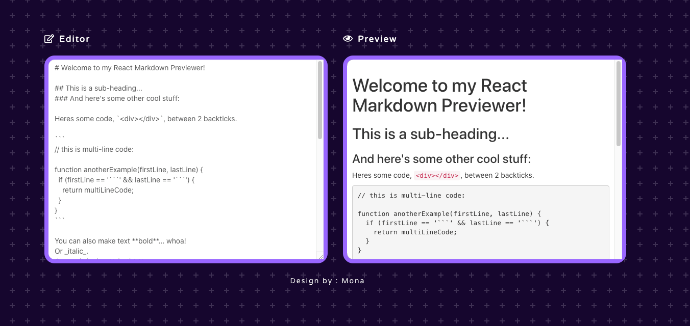

# fccMarkdown

demo : https://silly-williams-d8df36.netlify.app/

<ls>
  <li>Clone this repo.</li>
	<li>Run <code>npm install</code>.</li>
	<li>Run <code>npm start</code>.</li>
</ls>
 

<a href='https://marked.js.org/'>Check out Marked Documentation</a>

